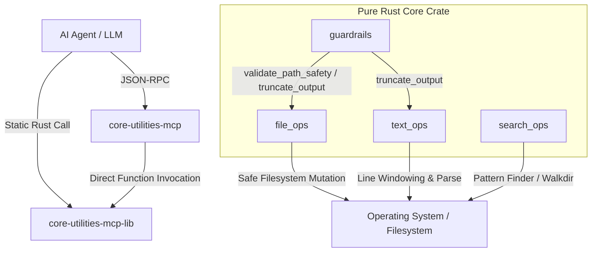

# Architecture: AI-Native Command Interface (ACI)

## Mission Statement
Traditional UNIX-style command-line interfaces, designed for human interaction and shell piping, are suboptimal for agentic workflows due to high token noise, lack of semantic structure, and high risk of destructive errors.

`core-utilities-mcp` provides an **AI-Native Command Interface (ACI)** that is highly structured, deterministic, token-efficient, and safe.

---

## 📐 Design Philosophy

1. **Semantic Clarity (Intent-Based)**: Commands are named based on the intent of the operation.
2. **Token Defense (Context Efficiency)**: Enforces smart pagination and truncation at the native layer to conserve context tokens.
3. **Deterministic Safety (Water-Edge Defense)**: Mechanically blocks dangerous paths (`.`, `/`, `*`, `~`, `""`, etc.) before executing destructive filesystem actions.
4. **Zero-Process Library Execution**: Functions are separated into a pure Rust crate, eliminating process spawning overhead and allowing direct links.

---

## 🏗️ Cargo Workspace Modular Architecture

### 1. `core-utilities-mcp-lib` (Core Library Engine)
Decoupled logic without process boundaries. Organized into:
- `guardrails`: Independent pure functions validating paths and executing smart truncation.
- `file_ops`: High-performance filesystem operations utilizing native Rust APIs.
- `search_ops`: High-efficiency grep and find implementations.
- `text_ops`: Utilities for pagination, line-windowing, and structured extraction.

### 2. `core-utilities-mcp` (External Protocol Wrapper)
A thin binary layer acting as an MCP server. It listens on `stdin` for JSON-RPC requests, parses input into strongly-typed Rust structures, executes them via `core-utilities-mcp-lib`, and outputs structured JSON responses.

---

## 🛡️ Key Safety Systems

### Water-Edge Path Defense
Destructive operations validate target paths string-by-string. An attempt to modify or delete root `/`, working directory `.`, home `~`, empty values `""`, or wildcard patterns (`/*`, `/.*`) is blocked dynamically.

### Smart Output Truncation
Prevents LLM token overflow by reading `AI_COMMAND_MAX_CHARACTERS` (default: `8192`). 
The output is automatically truncated at the closest preceding newline (`\n`). If no newline exists, it truncates hard. Truncated output sets status to `"truncated"` and exposes `next_offset` for paging.
