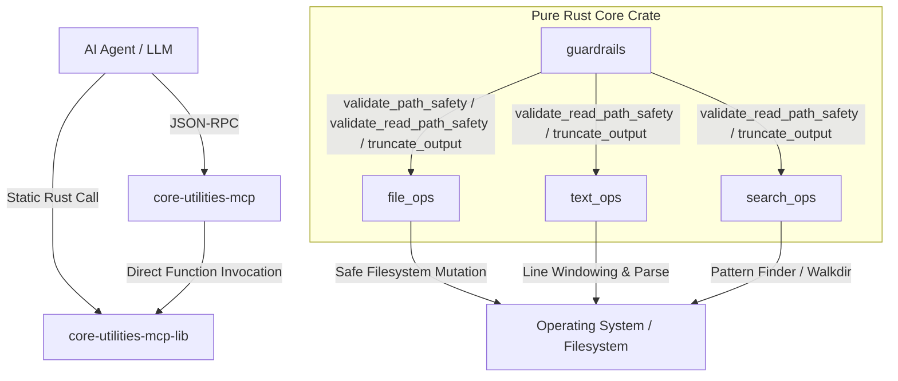

# Architecture: AI-Native Command Interface (ACI)

## Mission Statement
Traditional UNIX-style command-line interfaces, designed for human interaction and shell piping, are suboptimal for agentic workflows due to high token noise, lack of semantic structure, and high risk of destructive errors.

`core-utilities-mcp` provides an **AI-Native Command Interface (ACI)** that is highly structured, deterministic, token-efficient, and safe.

---

## 🎯 Threat Model & Scope

`core-utilities-mcp` is built for a single trusted user running a single agent against a known local directory (e.g. `~/projects/rad`) — it is not a multi-tenant service, and it is not designed to withstand an adversarial or compromised caller.

**What it defends against**: an AI agent going off-script — a hallucinated path, an overly broad `rm`/`mv` target, an edit landing outside the intended project. This is *mistake prevention*, not a security boundary.

**What it does not defend against**: a determined or maliciously-instructed caller. Guardrails do not resolve symlinks, and — critically — `execute_command` is not path-validated at all; anything routed through it bypasses every other guardrail in this crate entirely (see [The Shell Escape Hatch](#the-shell-escape-hatch-execute_command) below). If you need isolation from an untrusted or adversarial caller, wrap the whole process in an OS-level boundary (container, VM, restricted user) — this crate does not attempt to provide one itself.

Every design decision below should be read against this model: invest in guarding against realistic agent mistakes in this single-user, local context; don't build security theater for threats this project doesn't actually face.

---

## 📐 Design Philosophy

1. **Semantic Clarity (Intent-Based)**: Commands are named based on the intent of the operation.
2. **Token Defense (Context Efficiency)**: Enforces smart pagination and truncation at the native layer to conserve context tokens.
3. **Deterministic Safety (Water-Edge Defense)**: Mechanically blocks dangerous paths (`.`, `/`, `*`, `~`, `""`, etc.) before executing destructive filesystem actions.
4. **Zero-Process Library Execution**: Functions are separated into a pure Rust crate, eliminating process spawning overhead and allowing direct links.
5. **Scope Discipline (Uniformity Litmus Test)**: A tool belongs in this crate only if it operates deterministically and uniformly regardless of content — true to the spirit of standard UNIX utilities. Anything that would need open-ended, format- or language-specific intelligence to be *correct* (e.g. a real per-language code-structure parser) doesn't belong here, no matter how useful it might be — that's a different kind of tool. (`extract_code_skeleton` was removed for exactly this reason.)

---

## 🏗️ Cargo Workspace Modular Architecture

### 1. `core-utilities-mcp-lib` (Core Library Engine)
Decoupled logic without process boundaries. Organized into:
- `guardrails`: Independent pure functions validating paths and executing smart truncation.
- `file_ops`: High-performance filesystem operations utilizing native Rust APIs.
- `search_ops`: High-efficiency grep and find implementations.
- `text_ops`: Utilities for pagination, line-windowing, and structured extraction.

### 2. `core-utilities-mcp` (External Protocol Wrapper)
A thin binary layer acting as an MCP server. It listens on `stdin` for JSON-RPC requests, parses input into strongly-typed Rust structures, executes them via `core-utilities-mcp-lib`, and outputs structured JSON responses.

---

## 🛡️ Key Safety Systems

### Water-Edge Path Defense
Destructive operations (`validate_path_safety`) reject root `/`, home `~`, empty values `""`, or wildcard patterns (`/*`, `/.*`) by exact match, and reject the current working directory under *any* spelling that lexically collapses to it (`.`, `./`, `a/..`, ...) — a plain string comparison against `.` alone would miss those equivalent spellings, so `.`/`..` components are resolved lexically first (no disk access, so this also works for not-yet-existing mutation targets). Alongside these, a fixed deny-list of critical system directories (`/etc`, `/usr`, `/bin`, `C:\Windows`, etc.) is rejected — subpaths beneath them remain permitted.

Read-only operations (`validate_read_path_safety`) share every check above *except* the current-directory rejection: `list_directory_contents`, `get_file_metadata`, and the read paths in `search_ops`/`text_ops` all permit `.` — several of them default to it — since reading or listing "here" cannot destroy anything the way a mutation could.

**Optional workspace confinement**: setting `AI_WORKSPACE_ROOT` restricts every path-validated call to that directory (and its subdirectories); anything outside it, including via `../` traversal, is rejected. Off by default. As with everything else here, this is a mistake-prevention guard, not an adversarial boundary — see [Threat Model & Scope](#-threat-model--scope).

### The Shell Escape Hatch (`execute_command`)
Modeled after the bash tool found in coding-agent toolkits, this runs an arbitrary shell command with a wall-clock timeout and an output-size guard — nothing more. It is **not** path-validated, **not** confined by `AI_WORKSPACE_ROOT`, and provides no filesystem, network, CPU, or memory isolation from the host.

This is a deliberate design choice, not an oversight: without unrestricted shell access, an agent's practical capability collapses — this tool exists precisely because the structured, deterministic tools above it can't cover everything. Rather than fighting that by trying to sandbox it (disproportionate for the single-user, local, trusted context this crate targets), the design leans into it: invest in making it maximally *useful* (`timeout_seconds` overriding `AI_COMMAND_TIMEOUT_SECONDS`; `working_directory` defaulting to `AI_WORKSPACE_ROOT`) rather than pretending to make it safe, and state its limits honestly everywhere it's described.

### Smart Output Truncation
Prevents LLM token overflow by reading `AI_COMMAND_MAX_CHARACTERS` (default: `8192`). 
The output is automatically truncated at the closest preceding newline (`\n`). If no newline exists, it truncates hard. Truncated output sets status to `"truncated"` and exposes `next_offset` for paging.
